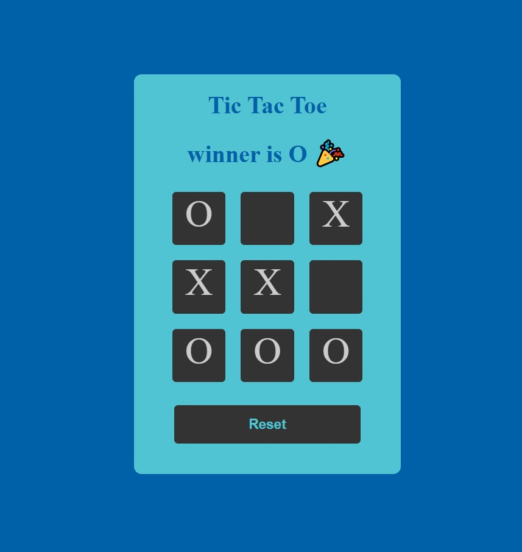

<b><h1>Tic-Tac-Toe</h1></b> 
<ul>
<li> It is a game for two players who take turns marking the spaces in a three-by-three grid with X or O. The player who succeeds in placing three of their marks in a horizontal, vertical, or diagonal row is the winner. </li>
</ul>
<h2>Library used</h2> 
<ul>
<li> Reactjs </li>
</ul>
<h2>Technologies used</h2>
<ul>
<li> Html </li>
<li> Css </li>
<li> Javascript </li>
</ul>
<h2>To run this project</h2>
<ol>
<li> clone the repository to desired location ( "git clone [url]" ) </li>
<li> Type the command ( "npm install" ) </li>
<li> Run the project ( "npm start" )</li>
</ol>

<h2>Snapshot</h2>

 

<h2>Link </h2> https://naman814.github.io/React-Hooks-tic_tac_toe
