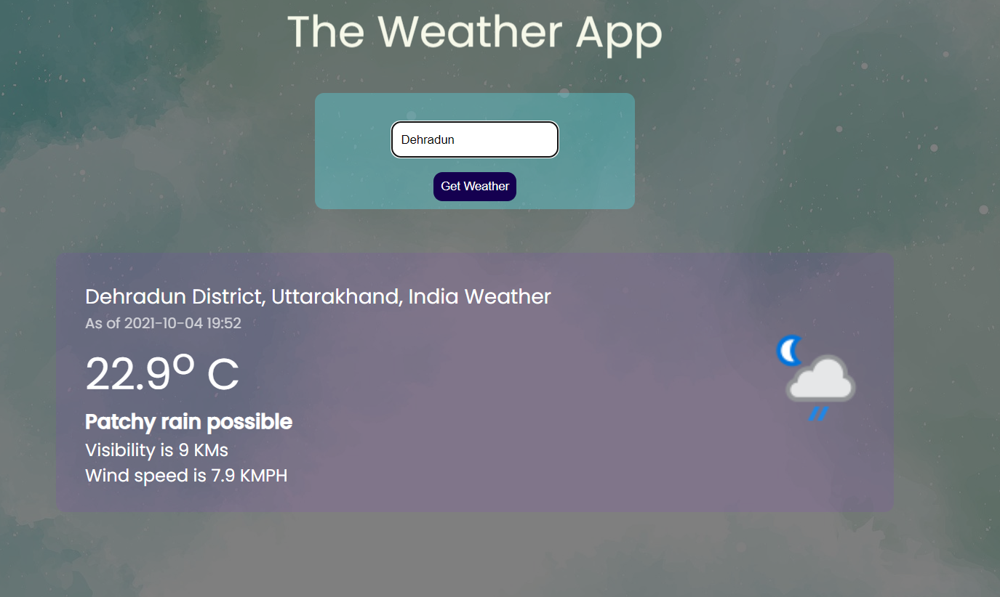

# Weather Application
## Description
A Web App to give weather of specific city.

### Technologies used
- HTML  
- CSS  
- JavaScript
- API

### Screenshot  
  
  
 
 Link : https://singhanubhav.me/weather-app/  
 
<h3>Connect</h3>

  

