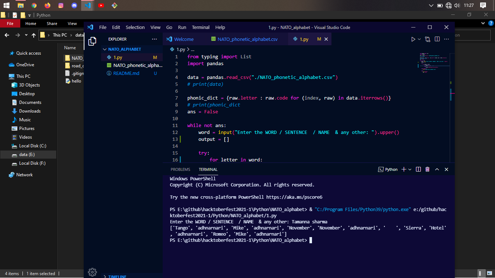

# THE NATO_ALPHABET PROJECT

## Functionality
- break any word in the letters and then make a dictionary in which key the letter and the value is the word start with the corresponding letter.

### Technologies used
- basic python.
- file handling.
- using csv's and little bit pandas lib.

### have a look

